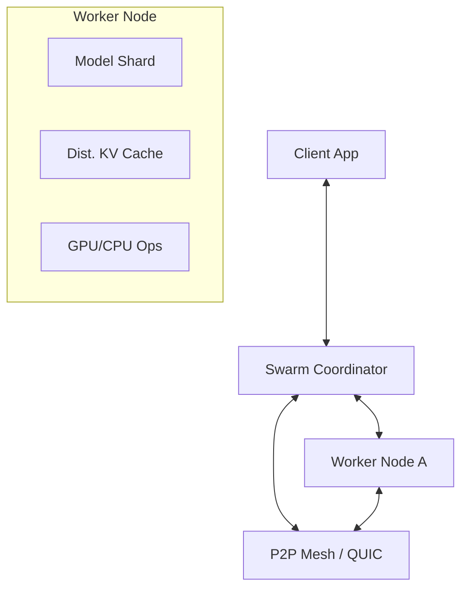

# 🐝 Swarm Inference Protocol

[](https://github.com/tasuke-pochira/swarm-inference/actions)
[](LICENSE)
[](https://www.rust-lang.org/)
[](docs/performance.md)

**Swarm Inference** is a high-performance, distributed, and fault-tolerant AI inference protocol designed for the decentralized era. It leverages swarm intelligence and peer-to-peer coordination to execute large-scale AI models across heterogeneous clusters of GPUs and CPUs.

## 🌟 Why Swarm Inference?

Traditional inference stacks are centralized and brittle. Swarm Inference provides a resilient, peer-to-peer alternative that excels in:

*   **Elastic Scaling**: Automatically grows and shrinks the cluster based on demand.
*   **Zero-Trust Security**: Native TLS 1.3, mutual authentication, and comprehensive audit logging.
*   **extreme Fault Tolerance**: Reed-Solomon erasure coding keeps the swarm alive even when nodes vanish.
*   **Hardware Heterogeneity**: Seamlessly orchestrates workloads across mixed NVIDIA, AMD, and CPU-only nodes.

## 🚀 Core Features

- **🌐 P2P Coordination**: No central bottleneck. Nodes coordinate via a high-performance consensus layer.
- **⚡ QUIC-Powered**: Built on top of `quinn` for multi-stream, low-latency communication.
- **🛡️ Erasure Coded Cache**: Distributed KV-cache protected by redundancy shards.
- **📈 Advanced Auto-scaling**: Predictive scaling based on queue depth and hardware telemetry.
- **📊 Real-time Observability**: Built-in dashboard and metrics for cluster-wide health monitoring.

## 🏗️ Architecture at a Glance



## 🛠️ Getting Started

### Installation

```bash
cargo install swarm-inference
```

### Quick Run (Development Mode)

```bash
# Start the coordinator
swarm_inference coordinator --port 8080

# Join the swarm with a worker node
swarm_inference node --coordinator 127.0.0.1:8080 --gpu-backend cuda
```

## 📖 Further Reading

*   **[Deployment Guide](docs/deployment.md)**: Production-ready setups.
*   **[Architecture Deep-Dive](docs/architecture.md)**: How the swarm works.
*   **[API Reference](docs/api.md)**: REST and WebSocket specs.
*   **[Roadmap](github_launch_roadmap.md)**: Our path to 1.0.

## 🤝 Contributing

We welcome contributions of all kinds! Check out our [Contributing Guide](CONTRIBUTING.md) to get started.

## 👥 Credits

**Swarm Inference** is developed and maintained by **Tasuke Pochira**, an independent developer passionate about decentralized AI infrastructure.

## 📄 License

Distributed under the Apache 2.0 License. See `LICENSE` for more information.
```

### Metrics

```bash
./target/release/swarm_inference metrics
```

### Dashboard

```bash
./target/release/swarm_inference dashboard --addr 127.0.0.1:9090
```

## Configuration

The system supports flexible configuration through defaults, config files, environment variables, and command-line overrides.

### Config File

Create a `config.yaml` file (see `config.yaml` for a complete example):

```yaml
network:
  listen_addr: "127.0.0.1:8080"
  coordinator_addr: "127.0.0.1:8080"
monitoring:
  dashboard_addr: "127.0.0.1:9090"
  tracing_level: "info"
```

### Environment Variables

Override any setting with `SWARM_` prefixed environment variables:

```bash
export SWARM_NETWORK__LISTEN_ADDR="0.0.0.0:8080"
export SWARM_MONITORING__TRACING_LEVEL="debug"
```

### Command Line

```bash
# Use config file
./target/release/swarm_inference --config config.yaml node --id 1

# Override with env vars
SWARM_NETWORK__LISTEN_ADDR="0.0.0.0:8080" ./target/release/swarm_inference node --id 1
```

- **Network Latency**: Compression and efficient protocols
- **Predictive Routing**: (Planned)
- **Asynchronous KV-Cache Sync**: (Planned)
- **Fault Tolerance**: Heartbeats and error handling

## Production Readiness Progress

See TODO.md for detailed roadmap. Key completed items:
- ✅ Efficient tensor serialization with compression
- ✅ Real model loading (Candle-based)
- ✅ Heartbeat mechanisms
- ✅ Comprehensive logging
- ✅ Metrics collection

## Future Work

- Integrate real LLM models with Candle
- Implement KV-cache synchronization
- Add predictive routing algorithms
- Enhance fault tolerance with node discovery and failover