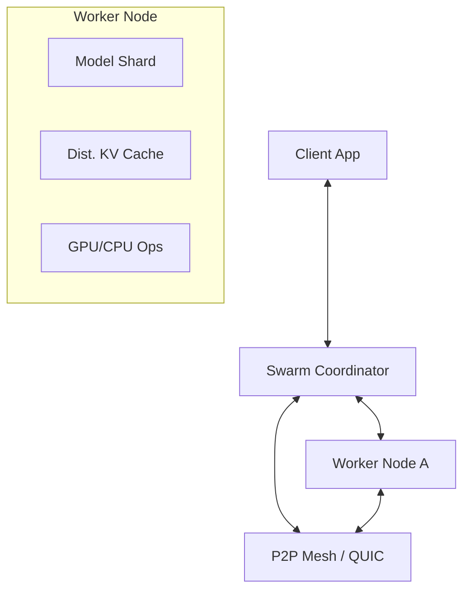

# 🐝 Swarm Inference Protocol

[](https://github.com/tasuke-pochira/swarm-inference/actions)
[](LICENSE)
[](https://www.rust-lang.org/)
[](docs/performance.md)

**Swarm Inference** is a high-performance, distributed, and fault-tolerant AI inference protocol designed for the decentralized era. It leverages swarm intelligence and peer-to-peer coordination to execute large-scale AI models across heterogeneous clusters of GPUs and CPUs.

## 🌟 Key Pillars

Traditional inference stacks are centralized and brittle. Swarm Inference provides a resilient, peer-to-peer alternative:

- **⚡ Performance Without Bottlenecks**: Multi-stream QUIC communication via `quinn` ensures low-latency token delivery across the swarm.
- **🛡️ Extreme Fault Tolerance**: Distributed KV-cache protected by Reed-Solomon erasure coding. The swarm survives even when nodes vanish.
- **📈 Intelligent Scaling**: Predictive auto-scaling that anticipates load by monitoring queue depths and hardware telemetry.
- **🔐 Zero-Trust Foundation**: Native TLS 1.3, mutual mTLS authentication, and comprehensive audit logging for every inference step.
- **🌐 Hardware Fluidity**: Seamlessly orchestrates workloads across mixed NVIDIA (CUDA), AMD, and CPU-only nodes.

## 🏗️ Architecture

Swarm Inference uses a peer-to-peer mesh architecture where any node can act as a coordinator or a worker, depending on the swarm's needs.



## 🛠️ Getting Started

### 1. Installation

```bash
cargo install swarm-inference
```

### 2. Launch the Coordinator
The coordinator manages task distribution and swarm health.

```bash
swarm_inference coordinator --port 8080
```

### 3. Join the Swarm
Start worker nodes and point them to your coordinator.

```bash
swarm_inference node --id 1 --coordinator 127.0.0.1:8080 --gpu-backend cuda
```

## 🎮 Usage & Observability

### Real-time Dashboard
Monitor your swarm's health, latency, and throughput via the built-in observability dashboard.

```bash
# Start the dashboard on port 9090
swarm_inference dashboard --addr 127.0.0.1:9090
```

### Live Metrics
Expose Prometheus-compatible metrics for integration with Grafana or external monitoring.

```bash
swarm_inference metrics
```

## ⚙️ Configuration

Swarm Inference is highly configurable via YAML, environment variables, or CLI flags.

### Configuration File (`config.yaml`)

```yaml
network:
  listen_addr: "127.0.0.1:8080"
  coordinator_addr: "127.0.0.1:8080"
monitoring:
  dashboard_addr: "127.0.0.1:9090"
  tracing_level: "info"
```

### Environment Overrides
Use the `SWARM_` prefix for any configuration key:

```bash
export SWARM_NETWORK__LISTEN_ADDR="0.0.0.0:8080"
export SWARM_MONITORING__TRACING_LEVEL="debug"
```

## 🚀 Roadmap & Status

Swarm Inference is currently in **Alpha (v0.1.0)**. 

### Current Capabilities
- ✅ **Distributed Consensus**: P2P protocol for inference result verification.
- ✅ **Erasure Coding**: Protection against node failure during cache synchronization.
- ✅ **Telemetry Pipeline**: Integrated logging, audit events, and metrics.
- ✅ **Model Agnostic**: Infrastructure ready for any Candle-supported model.

### Upcoming Milestones
- 🔄 **Predictive Routing**: Advanced algorithms for latency-minimized request routing.
- 🔄 **Dynamic Sharding**: Real-time model shard redistribution based on node capacity.
- 🔄 **WebUI Overhaul**: Next-gen dashboard with real-time swarm visualization.

For a detailed view of our launch journey, see [Roadmap](github_launch_roadmap.md).

## 🤝 Community & Legal

*   **[Documentation](docs/README.md)**: Explore the deeper [Architecture](docs/architecture.md) and [Deployment](docs/deployment.md) guides.
*   **[Contributing](CONTRIBUTING.md)**: We welcome PRs! Read our [Code of Conduct](CODE_OF_CONDUCT.md) first.
*   **[Security](SECURITY.md)**: Please report vulnerabilities responsibly.

### Credits
Developed and maintained by **Tasuke Pochira**, an independent developer building the future of decentralized AI infrastructure.

### License
This project is licensed under the Apache 2.0 License - see the [LICENSE](LICENSE) file for details.